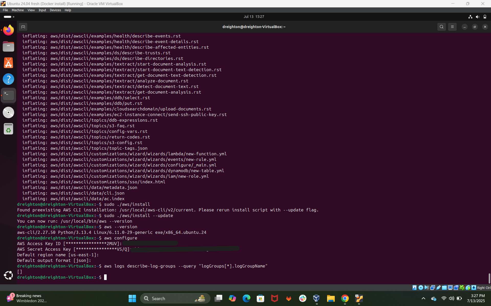
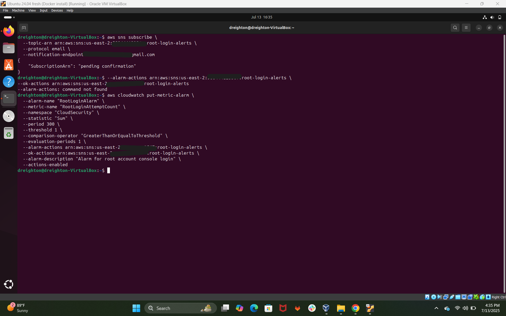
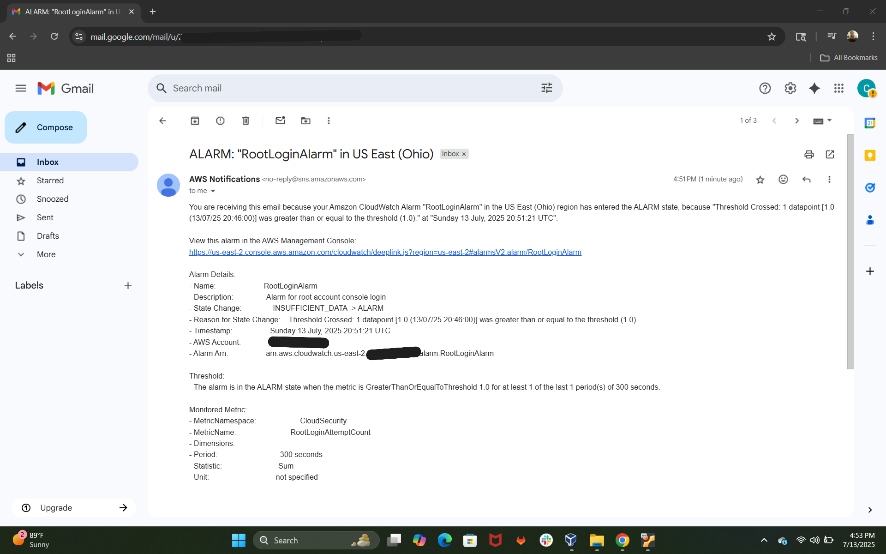
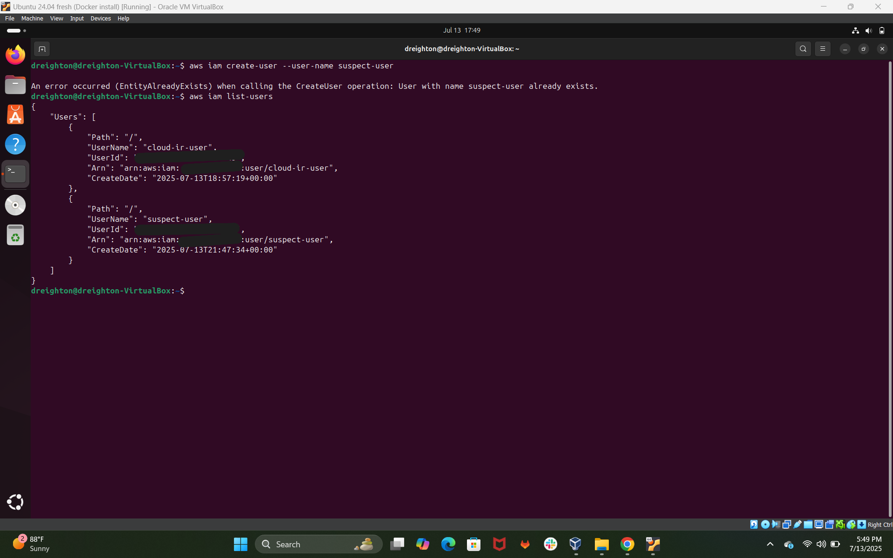
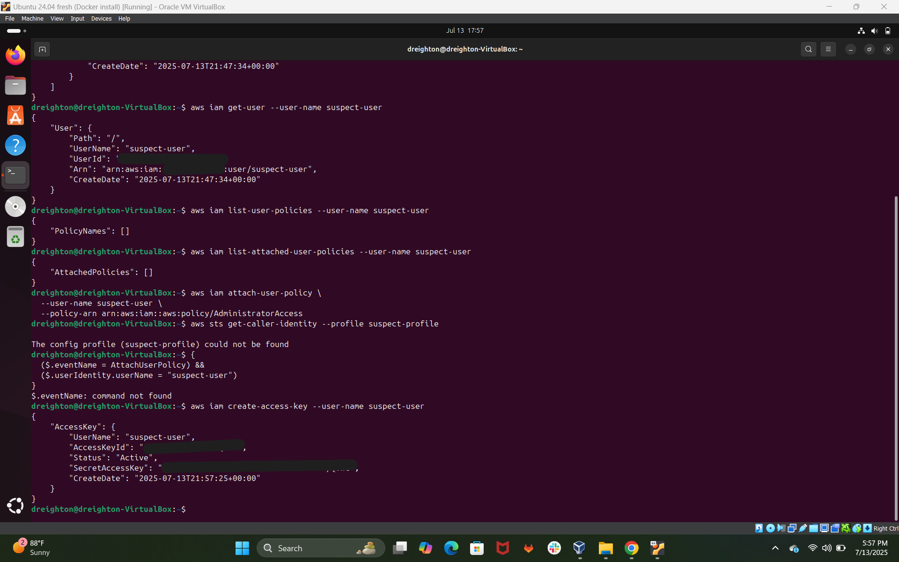
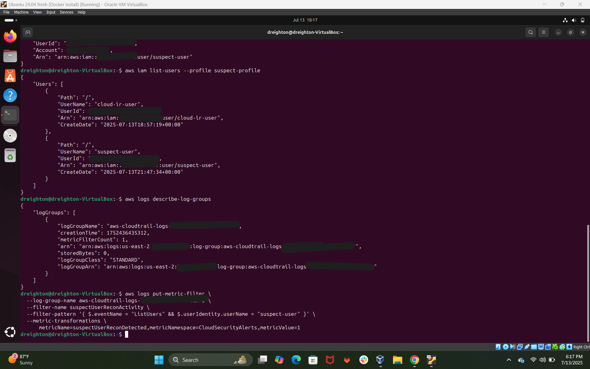
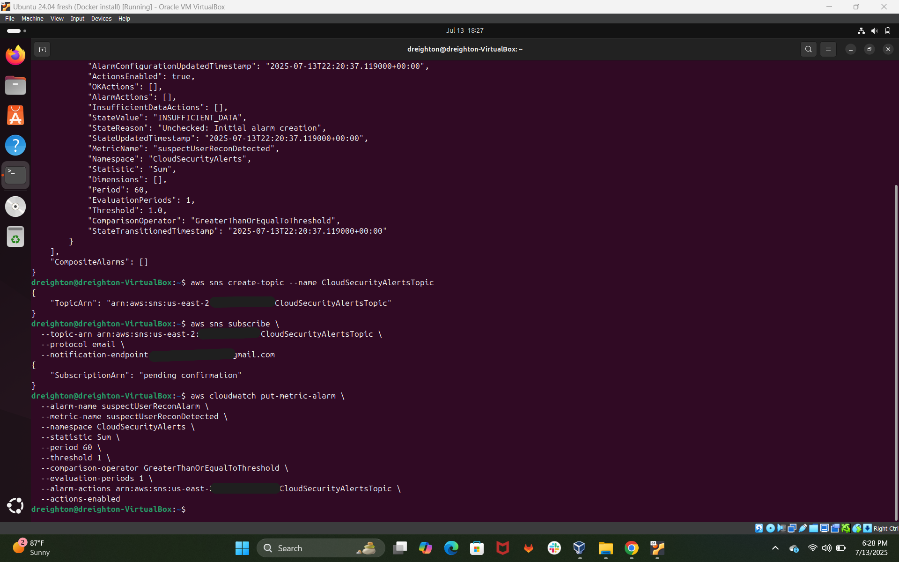
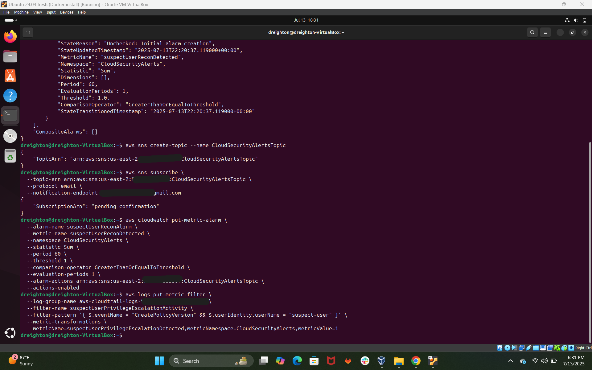
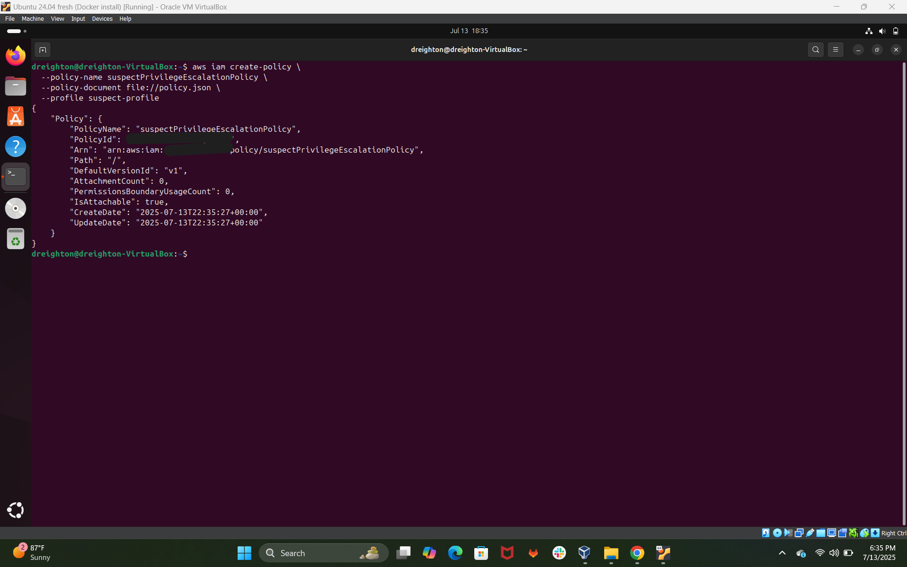

# 🔐 Cloud Incident Response + IAM Lockdown

## 🔢 Project Overview

This project simulates a real-world cloud incident response workflow in AWS. It detects suspicious user behavior in real time — such as unauthorized privilege escalation — and automatically triggers IAM lockdown actions to contain the threat.

✅ This project extends my previous **Cloud Security Alerting System (AWS + PostgreSQL)** by adding **automated incident response** and **IAM access control**, strengthening detection and containment within a cloud-native environment.

---

## 📊 Use Case

A user attempts to create IAM roles or policies without authorization. The system:

1. Detects the event through a CloudTrail filter  
2. Sends a CloudWatch alarm to an SNS topic  
3. Triggers an automated IAM policy lockdown  

---

## 🛠️ Architecture

- **CloudTrail**: Logs API events like `CreatePolicyVersion`  
- **CloudWatch Logs + Metric Filter**: Detects suspicious user activity  
- **CloudWatch Alarm**: Monitors for filtered events and sends notifications  
- **SNS Topic**: Sends alert to email or Lambda  
- **IAM Policy + CLI**: Restricts access to mitigate the threat  

---

## 🔧 Tools & Services Used

- AWS CloudTrail  
- AWS CloudWatch Logs & Alarms  
- Amazon SNS  
- IAM (Identity and Access Management)  
- AWS CLI  
- Ubuntu 24.04 VM (VirtualBox)  

---

## 🔢 Sample Detection Logic

```json
{
  "eventName": "CreatePolicyVersion",
  "userIdentity": {
    "userName": "suspect-user"
  }
}
```

## ⚡ Alert Workflow
- CloudTrail logs an unauthorized CreatePolicyVersion event
- Metric filter flags the log with metricValue = 1
- CloudWatch Alarm triggers based on threshold = 1
- SNS notifies the security team or initiates an IAM lockdown

---

## 🔐 IAM Lockdown Scenario
aws iam create-policy-version \
--policy-arn arn:aws:iam::YOUR_ACCOUNT_ID:policy/suspectPrivilegeEscalationPolicy \
--policy-document file://policy.json \
--set-as-default \
--profile suspect-profile

---

## 💪 Key Skills Demonstrated
- Cloud Security Monitoring
- IAM Policy Management
- Incident Response Automation
- AWS CLI Proficiency
- Log Filtering & Correlation

---

## 🌟 Why It Stands Out
- Real-time detection and response ✅
- Security automation (no manual triage) ✅
- Includes alert-to-response flow ✅
- Job-ready architecture for SOC and Cloud Analyst roles ✅

---

## 📚 Lessons Learned
- How to convert logs to metrics
- When to trigger alarms using thresholds
- How to safely rotate IAM policies via CLI
- Cloud-native response without third-party tools

---

## 📸 Screenshots

*CloudTrail initialized for activity logging*


*Logging turned on for governance and visibility*


*EventBridge rule routes IAM change events*


*Verifying metric filter setup for CloudTrail log group*


*Fixing filter destination for log group*


*CloudWatch alarm monitors root account logins*


*Email notification triggered by root login*


*Root login event captured in logs*


*Suspicious user detected in IAM*


*Getting user metadata and ARN*


*No policies initially attached to the user*


*Privilege escalation via AdministratorAccess*


*Suspect creates new access key (compromise starts)*


*Profile set with stolen credentials*


*CLI confirms correct configuration*


*Attacker recon via CLI command*


*Custom filter for recon pattern added*


*Metric alarm created for suspicious recon*


*Alert sent when threshold breached*


*Log filter added for escalation attempt*


*Custom lockdown policy drafted*


*Policy successfully deployed*


*Alarm fires on policy misuse*


*CloudWatch confirms incident severity*
